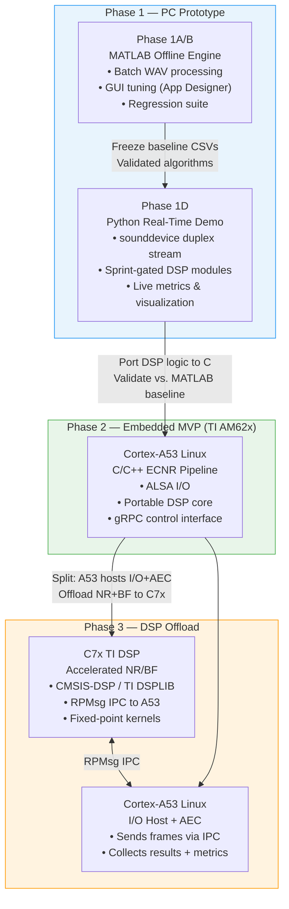
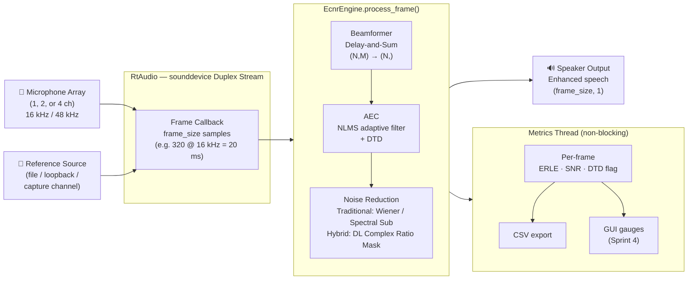
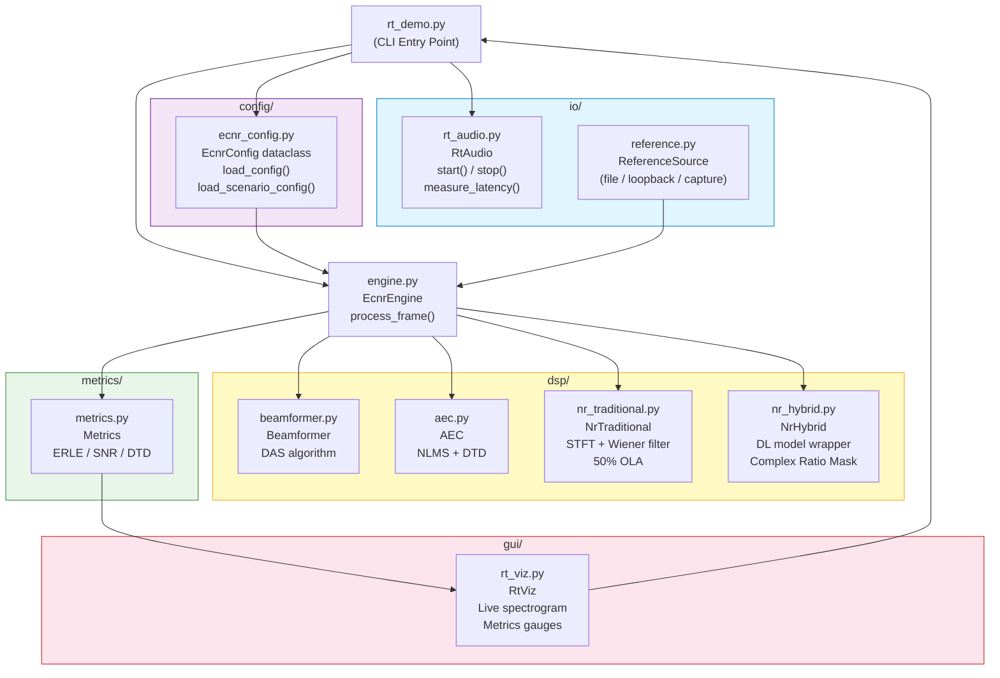
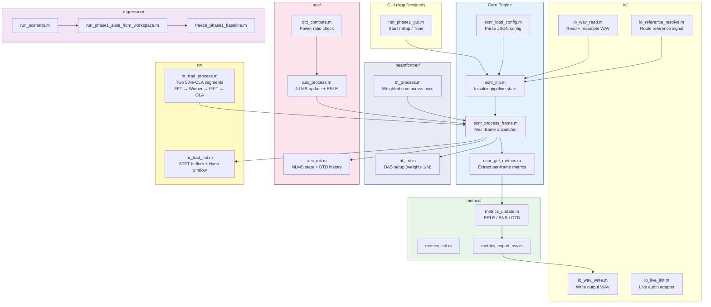
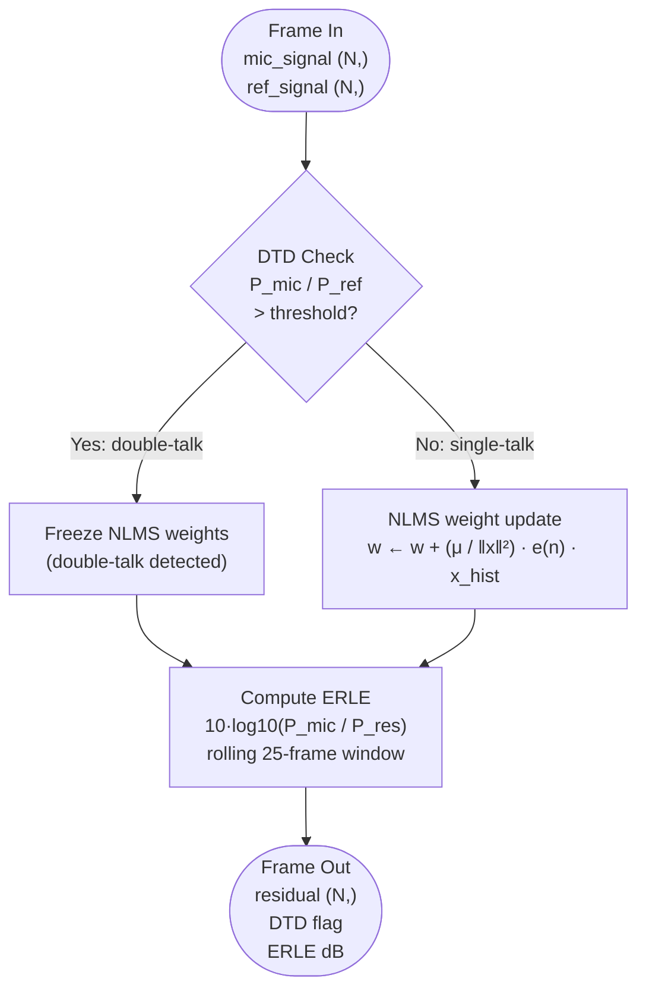
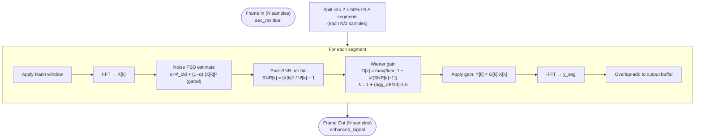
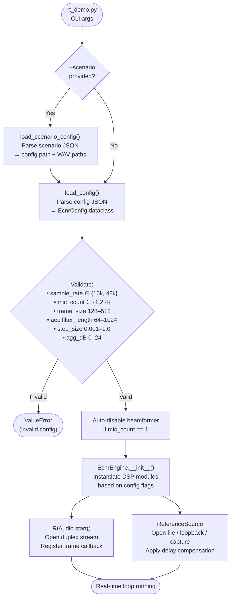
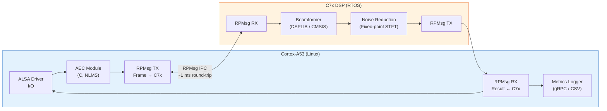

# ECNR Architecture Diagrams

**Version:** 1.0 | **Date:** May 2026 | **Status:** Active

All diagrams use [Mermaid](https://mermaid.js.org/) syntax, rendered natively on GitHub and in VS Code with the Mermaid Preview extension.

---

## 1. System Architecture Overview — Three-Phase Deployment

---

## 2. Real-Time Audio Processing Pipeline

---

## 3. Python Module Architecture

---

## 4. MATLAB Reference Engine Architecture

---

## 5. AEC — NLMS Frame Processing Flowchart

---

## 6. Traditional NR — STFT / OLA Processing Flowchart

---

## 7. Configuration & Scenario Loading Flow

---

## 8. Phase 3 — Embedded IPC Architecture (Future)

